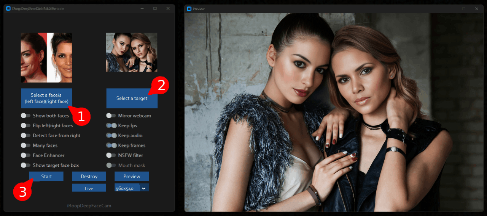
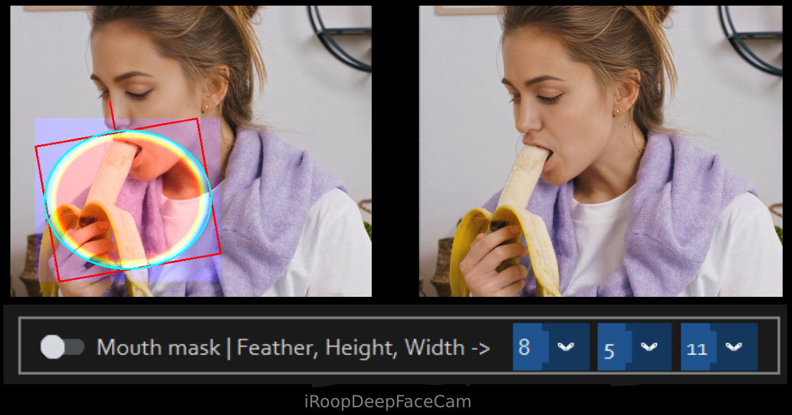
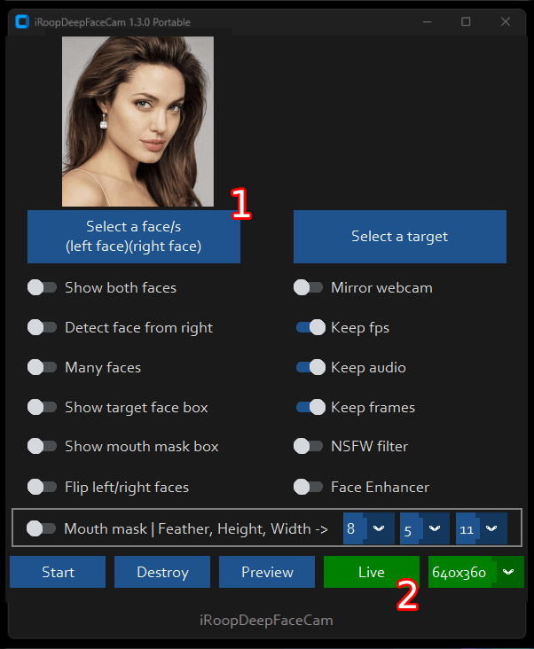
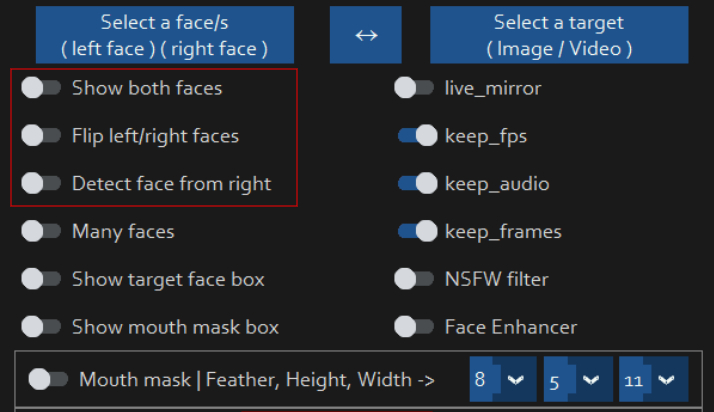

# iRoopDeepFaceCam 
Get ready to dive into a whole new world of fun with iRoopDeepFaceCam! This innovative tool, inspired by the original [roop](https://github.com/s0md3v/roop) and [Deep-Live-Cam](https://github.com/hacksider/Deep-Live-Cam), lets you create deep fakes using a live webcam, video, or image file. Want to make it even more exciting? Use an OBS virtual camera to act as your webcam!

What sets iRoopDeepFaceCam apart is its ability to work with one or two source faces and target one or two faces in real-time or in any video or image. Plus, the unique 'Mouth Mask' feature seamlessly blends the original mouth with the source face, allowing you to interact with objects and make your deep fakes look incredibly realistic.

But that's not all! iRoopDeepFaceCam also offers face tracking, perfect for keeping the magic alive when two people are on screen or when the scene changes. You can deep fake two people simultaneously, watch videos, or live stream with this fantastic feature. With all these powerful tools, iRoopDeepFaceCam opens up endless possibilities for creativity and fun. Dive in and start creating your own deep fake adventures today!

## One face replaced with live webcam

(watch this video to see how live webcam deep fake works)


Watch as a live webcam feed transforms into an incredible deep fake before your eyes! You’ll see the magic happen in real-time, with the deep fake capturing every detail — even light reflections on the face move naturally, making the transformation look unbelievably lifelike. It's not just a deep fake; it's like watching reality blend seamlessly with creativity!

(Credit: [Deep-Live-Cam](https://github.com/hacksider/Deep-Live-Cam))

## Two faces replaced on webcam

(watch this video to see how Two faces deep fake work)


Why settle for deep faking just one face when you can double the fun? With iRoopDeepFaceCam, you can use a source file with one or two faces to deep fake one or two people live on a webcam feed, video, or image. Imagine the endless possibilities for creating hilarious and entertaining YouTube videos—you and your partner can transform into anyone you want!

Take it up a notch by using OBS virtual webcam on livestreams, and watch as you create live deep fakes in real-time. There's no extra processing needed, so you can instantly make yourself appear in streams! With iRoopDeepFaceCam, the power to create amazing, fun, and engaging content is right at your fingertips. The only limit is your imagination!

## Supports processing of an image or video file with one or two faces plus mouth mask and face tracking on videos



With iRoopDeepFaceCam, you can process an image or video file with one or two faces, using advanced features like face tracking and the mouth mask feature for an ultra-realistic effect. Here’s how easy it is to get started: simply choose a source image with the desired face, select a target image or video where you want to replace the face, and hit Start.

Then, just open your file explorer and navigate to the directory where you want your output to be saved. You'll see a folder named after your video title, where you can watch the frames being swapped in real-time! Once the processing is complete, your final output file will be ready to go. It's that simple—no complicated steps, just straightforward deep fake magic!

## Mouth Mask mode allows you to interact with objects live via webcam, video or image

(watch this video to see how Mouth Mask works)


You can also enable Mouth Mask to process a video file or an image


With Mouth Mask mode in iRoopDeepFaceCam, you can interact with objects live via a webcam, video, or image, creating a seamless blend with the face swap. Imagine your face being deep-faked while eating, drinking, or talking—this groundbreaking technique lets you fully enjoy the magic of interactive deep fakes!

What’s truly incredible about this feature is its ability to work in real-time with your webcam, giving you complete control over the Mouth Mask to place it exactly where you want it. Whether you're creating fun content or experimenting with new ideas, this real-time capability makes it super easy and entertaining to explore. Plus, when you pair it with OBS virtual camera, it takes the fun to a whole new level, allowing you to bring your deep fakes to life in live streams like never before. Dive in and experience the thrill!



## Auto One or Two Face Tracking (Max two people in frame)


(watch this video to see how Two faces tracking works)


Auto One or Two Face Tracking in iRoopDeepFaceCam takes your deep fake experience to the next level! With this feature, you can track up to two people in a frame on either a webcam or video file. The software automatically detects target faces from the left side of the frame and assigns up to two source faces to two target faces. This feature shines when two people are in the frame, allowing you to deep fake and track one or both faces with ease.

Need to switch things up? You can reset face tracking at any time to switch sides, flip faces, or even detect faces from the right side of the screen. This breakthrough feature, combined with Mouth Mask mode, is incredibly powerful. It seamlessly tracks two people, even when the camera angle changes or the scene shifts, letting them interact naturally and even switch sides in the room. With iRoopDeepFaceCam's face tracking, you'll always know where the person is, making for a smooth and dynamic deep fake experience!

## Live Webcam Buttons


To kick off the Live webcam feature in iRoopDeepFaceCam, just hit the 'Live' button. It takes about 30 seconds for the preview window to pop up. You can adjust the resolution of the live webcam to suit your needs, but keep in mind that higher resolutions may slow down the face swap process. Feel free to switch resolutions based on your computer's power and performance.

No worries about the preview window size—you can resize it independently of the webcam resolution. Want to go full screen? You can make the preview window as large as you like without affecting the deep fake rendering. The rendering will stay smooth, no matter the size of your preview window. Enjoy seamless deep fake fun with complete control over your setup!  

## How do I use it?
> Note: When you run this program for the first time, it will download some models ~300MB in size.

Executing `python run.py` command will launch this window:

## For the webcam mode



Here's how to get started with iRoopDeepFaceCam:
1. Select a Face: Choose an image with either one or two faces. The left face will be used as Face 1, and the right face will be used as Face 2.
2. Click Live: Hit the 'Live' button to start the live webcam feed.
3. Wait a Few Seconds: It may take 10 to 30 seconds for the preview window to appear, so hang tight as the system prepares.

And that's it! You're all set to start your deep fake adventure. Enjoy the show!


(Credit: [Deep-Live-Cam](https://github.com/hacksider/Deep-Live-Cam))

Just use your favorite screencapture to stream like OBS
> Note: In case you want to change your face, just select another picture, the preview mode will then restart (so just wait a bit).
>

## One/Two face controls for webcam mode, video or image
You can control how a face/s is replaced on target face\s



1. **Show Both Faces**: Enable this option if your source image has two faces and you want to replace both faces in your webcam feed, video, or image. By default, the left face in the source image is "Face 1" and the right face is "Face 2". If a face goes out of the frame in your video, "Face 1" will be used. To switch which face is used, see the "Flip left/right faces" option below.

2. **Flip Left/Right Faces**: Turn this option on to swap the roles of the faces in your source image. The right face becomes "Face 1" and the left face becomes "Face 2". This is handy for swapping faces in your webcam feed, video, or image when you have one or two faces. 

3. **Detect Face from Right**: Use this feature when you have one target face and the "Show both faces" option is off. By default, faces are detected from the left side of the webcam, video, or image. If you have background elements like a picture frame to the left of the person, this option helps by detecting and replacing "Face 2" first, then "Face 1". This allows you to control which detected face gets replaced first.

These features give you flexible control over your deep fake creations, ensuring you get the results you want!

## Disclaimer
This software is meant to be a productive contribution to the rapidly growing AI-generated media industry. It will help artists with tasks such as animating a custom character or using the character as a model for clothing etc.

The developers of this software are aware of its possible unethical applications and are committed to take preventative measures against them. It has a built-in check which prevents the program from working on inappropriate media including but not limited to nudity, graphic content, sensitive material such as war footage etc. We will continue to develop this project in the positive direction while adhering to law and ethics. This project may be shut down or include watermarks on the output if requested by law.

Users of this software are expected to use this software responsibly while abiding by local laws. If the face of a real person is being used, users are required to get consent from the concerned person and clearly mention that it is a deepfake when posting content online. Developers of this software will not be responsible for actions of end-users.

## How do I install it?

### I strongly recommend you check out [Deep-Live-Cam](https://github.com/hacksider/Deep-Live-Cam) as iRoopDeepFaceCam was based on thier original work. Checkout their [issues](https://github.com/hacksider/Deep-Live-Cam/issues) page as they will more then likely have the solution for you 

### Basic: It is more likely to work on your computer but it will also be very slow. You can follow instructions for the basic install (This usually runs via **CPU**)
#### 1.Setup your platform
-   python (3.10 recommended)
-   pip
-   git
-   [ffmpeg](https://www.youtube.com/watch?v=OlNWCpFdVMA) 
-   [visual studio 2022 runtimes (windows)](https://visualstudio.microsoft.com/visual-cpp-build-tools/)

#### 2. Clone Repository
1. Clone the Repository:
    First, you need to clone the repository to your computer. For this example, we'll use a PC. You can either clone the repository directly to the root drive or into a specific folder of your choice.

2. Choosing a Location:
   You can clone the repository to the root of your C:\ drive or into a specific folder, like C:\iRoopDeepFaceCam. It’s up to your personal preference.
    - Open your command prompt or terminal.
    - Navigate to the root of the C:\ drive or the folder where you want to clone the repository.
        - To navigate to the root drive, you can use:
          
        ```cd C:\```
        - To navigate to a specific folder, use:
        
        ```cd C:\iRoopDeepFaceCam```

    - Run the following command to clone the repository:

        ```git clone https://github.com/iVideoGameBoss/iRoopDeepFaceCam.git```

    If you cloned the repository to the root drive, it will be directly in C:. If you chose a specific folder, navigate to that folder first before running the clone command.

2. Navigate to the Cloned Repository:
   Once the repository has been cloned, you need to navigate into the iRoopDeepFaceCam folder.
    - If you cloned to the root drive, use:

       ```cd iRoopDeepFaceCam```
      
    - If you cloned into a specific folder (e.g., C:\iRoopDeepFaceCam), you would still use:

       ```cd iRoopDeepFaceCam```
        
Regardless of where you cloned the repository, ensure you navigate to the iRoopDeepFaceCam folder to proceed with further instructions.

#### 2. Download Models

 1. [GFPGANv1.4](https://huggingface.co/ivideogameboss/iroopdeepfacecam/blob/main/GFPGANv1.4.pth)
 2. [inswapper_128_fp16.onnx](https://huggingface.co/ivideogameboss/iroopdeepfacecam/blob/main/inswapper_128_fp16.onnx) *(Note: Use this [replacement version](https://github.com/facefusion/facefusion-assets/releases/download/models/inswapper_128_fp16.onnx) if an issue occurs on your computer)*

Then put those 2 files oi the "**models**" folder

#### 3. Setup VENV enviroment. We highly recommend to work with a  `venv`  to avoid issues.

1. Run each command line by line from the iRoopDeepFaceCam you navigated to from the instructinons above

   ```python -m venv venv```
      
   ```cd venv```
      
   ```cd Scripts```
      
   ```activate```
      
   ```cd..```
      
   ```cd..```
      
#### 4. Install dependency
Continuing from the instructions above, you will need to run the following command to install the necessary dependencies:
```
pip install -r requirements.txt
```
It's a good idea to run this command at least twice to ensure all components are installed correctly. Sometimes, running it multiple times may reveal additional files or dependencies that need to be in place for everything to be set up properly.

For MAC OS, You have to install or upgrade python-tk package:
```
brew install python-tk@3.10
```
##### DONE!!! If you dont have any GPU, You should be able to run roop using `python run.py` command. Keep in mind that while running the program for first time, it will download some models which can take time depending on your network connection.

#### 6. Proceed if you want to use GPU acceleration (optional)

<details>
<summary>Click to see the details</summary>

### CUDA Execution Provider (Nvidia)*

1.  Install  [CUDA Toolkit 11.8](https://developer.nvidia.com/cuda-11-8-0-download-archive)
2.  Install dependencies:
```
pip uninstall onnxruntime onnxruntime-gpu
pip install onnxruntime-gpu==1.16.3
```

3.  Usage in case the provider is available:
```
python run.py --execution-provider cuda
```

### [](https://github.com/s0md3v/roop/wiki/2.-Acceleration#coreml-execution-provider-apple-silicon)CoreML Execution Provider (Apple Silicon)

1.  Install dependencies:

```
pip uninstall onnxruntime onnxruntime-silicon
pip install onnxruntime-silicon==1.13.1
```

2.  Usage in case the provider is available:
```
python run.py --execution-provider coreml
```

### [](https://github.com/s0md3v/roop/wiki/2.-Acceleration#coreml-execution-provider-apple-legacy)CoreML Execution Provider (Apple Legacy)

1.  Install dependencies:
```
pip uninstall onnxruntime onnxruntime-coreml
pip install onnxruntime-coreml==1.13.1
```

2.  Usage in case the provider is available:
```
python run.py --execution-provider coreml
```

### [](https://github.com/s0md3v/roop/wiki/2.-Acceleration#directml-execution-provider-windows)DirectML Execution Provider (Windows)

1.  Install dependencies:
```
pip uninstall onnxruntime onnxruntime-directml
pip install onnxruntime-directml==1.15.1
```

2.  Usage in case the provider is available:
```
python run.py --execution-provider directml
```

### [](https://github.com/s0md3v/roop/wiki/2.-Acceleration#openvino-execution-provider-intel)OpenVINO™ Execution Provider (Intel)

1.  Install dependencies:
```
pip uninstall onnxruntime onnxruntime-openvino
pip install onnxruntime-openvino==1.15.0
```

2.  Usage in case the provider is available:
```
python run.py --execution-provider openvino
```
</details>


Additional command line arguments are given below. To learn out what they do, check [this guide](https://github.com/s0md3v/roop/wiki/Advanced-Options).

```
options:
  -h, --help                                               show this help message and exit
  -s SOURCE_PATH, --source SOURCE_PATH                     select a source image
  -t TARGET_PATH, --target TARGET_PATH                     select a target image or video
  -o OUTPUT_PATH, --output OUTPUT_PATH                     select output file or directory
  --frame-processor FRAME_PROCESSOR [FRAME_PROCESSOR ...]  frame processors (choices: face_swapper, face_enhancer, ...)
  --keep-fps                                               keep original fps
  --keep-audio                                             keep original audio
  --keep-frames                                            keep temporary frames
  --many-faces                                             process every face
  --both-faces                                             use two faces in source image
  --flip-faces                                             flip two faces in source image from right to left
  --detect-face-right                                      detect target face from right of frame
  --show-target-face-box                                   show target face box
  --mouth-mask                                             show target mouth using mask
  --show-mouth-mask-box                                    show mouth mask box
  --face-tracking                                          track one or two faces when two people are in frame. Max two faces tracked
  --nsfw-filter                                            filter the NSFW image or video
  --video-encoder {libx264,libx265,libvpx-vp9}             adjust output video encoder
  --video-quality [0-51]                                   adjust output video quality
  --live-mirror                                            the live camera display as you see it in the front-facing camera frame
  --live-resizable                                         the live camera frame is resizable
  --max-memory MAX_MEMORY                                  maximum amount of RAM in GB
  --execution-provider {cpu} [{cpu} ...]                   available execution provider (choices: cpu, ...)
  --execution-threads EXECUTION_THREADS                    number of execution threads
  -v, --version                                            show program's version number and exit
```

Looking for a CLI mode? Using the -s/--source argument will make the run program in cli mode.

### Webcam mode on Windows 11 using WSL2 Ubuntu (optional)

<details>
<summary>Click to see the details</summary>

If you want to use WSL2 on Windows 11 you will notice, that Ubuntu WSL2 doesn't come with USB-Webcam support in the Kernel. You need to do two things: Compile the Kernel with the right modules integrated and forward your USB Webcam from Windows to Ubuntu with the usbipd app. Here are detailed Steps:

This tutorial will guide you through the process of setting up WSL2 Ubuntu with USB webcam support, rebuilding the kernel, and preparing the environment for the Deep-Live-Cam project.  
  
#### 1. Install WSL2 Ubuntu  
  
Install WSL2 Ubuntu from the Microsoft Store or using PowerShell:  
  
#### 2. Enable USB Support in WSL2  
  
1. Install the USB/IP tool for Windows:  
[https://learn.microsoft.com/en-us/windows/wsl/connect-usb](https://learn.microsoft.com/en-us/windows/wsl/connect-usb)  
  
2. In Windows PowerShell (as Administrator), connect your webcam to WSL:  
  
```powershell  
usbipd list  
usbipd bind --busid x-x # Replace x-x with your webcam's bus ID  
usbipd attach --wsl --busid x-x # Replace x-x with your webcam's bus ID  
```  
 You need to redo the above every time you reboot wsl or re-connect your webcam/usb device.
 
#### 3. Rebuild WSL2 Ubuntu Kernel with USB and Webcam Modules  
  
Follow these steps to rebuild the kernel:  
  
1. Start with this guide: [https://github.com/PINTO0309/wsl2_linux_kernel_usbcam_enable_conf](https://github.com/PINTO0309/wsl2_linux_kernel_usbcam_enable_conf)  
  
2. When you reach the `sudo wget [github.com](http://github.com/)...PINTO0309` step, which won't work for newer kernel versions, follow this video instead or alternatively follow the video tutorial from the beginning: 
[https://www.youtube.com/watch?v=t_YnACEPmrM](https://www.youtube.com/watch?v=t_YnACEPmrM)  
  
Additional info: [https://askubuntu.com/questions/1413377/camera-not-working-in-cheese-in-wsl2](https://askubuntu.com/questions/1413377/camera-not-working-in-cheese-in-wsl2)  
  
3. After rebuilding, restart WSL with the new kernel. 
  
#### 4. Set Up Deep-Live-Cam Project  
 Within Ubuntu:
1. Clone the repository:  
  
```bash  
git clone https://github.com/iVideoGameBoss/iRoopDeepFaceCam.git
```  

2. Follow the installation instructions in the repository, including cuda toolkit 11.8, make 100% sure it's not cuda toolkit 12.x.  
   
#### 5. Verify and Load Kernel Modules  
  
1. Check if USB and webcam modules are built into the kernel:  
  
```bash  
zcat /proc/config.gz | grep -i "CONFIG_USB_VIDEO_CLASS"  
```  
  
2. If modules are loadable (m), not built-in (y), check if the file exists:  
  
```bash  
ls /lib/modules/$(uname -r)/kernel/drivers/media/usb/uvc/  
```  
  
3. Load the module and check for errors (optional if built-in):  
  
```bash  
sudo modprobe uvcvideo  
dmesg | tail  
```  
  
4. Verify video devices:  
  
```bash  
sudo ls -al /dev/video*  
```  
  
#### 6. Set Up Permissions  
  
1. Add user to video group and set permissions:  
  
```bash  
sudo usermod -a -G video $USER  
sudo chgrp video /dev/video0 /dev/video1  
sudo chmod 660 /dev/video0 /dev/video1  
```  
  
2. Create a udev rule for permanent permissions:  
  
```bash  
sudo nano /etc/udev/rules.d/81-webcam.rules  
```  
  
Add this content:  
  
```  
KERNEL=="video[0-9]*", GROUP="video", MODE="0660"  
```  
  
3. Reload udev rules:  
  
```bash  
sudo udevadm control --reload-rules && sudo udevadm trigger  
```  
  
4. Log out and log back into your WSL session.  
  
5. Start Deep-Live-Cam with `python run.py --execution-provider cuda --max-memory 8` where 8 can be changed to the number of GB VRAM of your GPU has, minus 1-2GB. If you have a RTX3080 with 10GB I suggest adding 8GB. Leave some left for Windows.

#### Final Notes  
  
- Steps 6 and 7 may be optional if the modules are built into the kernel and permissions are already set correctly.  
- Always ensure you're using compatible versions of CUDA, ONNX, and other dependencies.  
- If issues persist, consider checking the Deep-Live-Cam project's specific requirements and troubleshooting steps.  
  
By following these steps, you should have a WSL2 Ubuntu environment with USB webcam support ready for the Deep-Live-Cam project. If you encounter any issues, refer back to the specific error messages and troubleshooting steps provided.

#### Troubleshooting CUDA Issues  

If you encounter this error:  
  
```  
[ONNXRuntimeError] : 1 : FAIL : Failed to load library [libonnxruntime_providers_cuda.so](http://libonnxruntime_providers_cuda.so/) with error: libcufft.so.10: cannot open shared object file: No such file or directory  
```  
  
Follow these steps:  
  
1. Install CUDA Toolkit 11.8 (ONNX 1.16.3 requires CUDA 11.x, not 12.x):  
[https://developer.nvidia.com/cuda-11-8-0-download-archive](https://developer.nvidia.com/cuda-11-8-0-download-archive)  
  select: Linux, x86_64, WSL-Ubuntu, 2.0, deb (local)
2. Check CUDA version:  
  
```bash  
/usr/local/cuda/bin/nvcc --version  
```  
  
3. If the wrong version is installed, remove it completely:  
[https://askubuntu.com/questions/530043/removing-nvidia-cuda-toolkit-and-installing-new-one](https://askubuntu.com/questions/530043/removing-nvidia-cuda-toolkit-and-installing-new-one)  
  
4. Install CUDA Toolkit 11.8 again [https://developer.nvidia.com/cuda-11-8-0-download-archive](https://developer.nvidia.com/cuda-11-8-0-download-archive), select: Linux, x86_64, WSL-Ubuntu, 2.0, deb (local)
  
```bash  
sudo apt-get -y install cuda-toolkit-11-8  
```
</details>

## Credits

- [Deep-Live-Cam](https://github.com/hacksider/Deep-Live-Cam): Original Deep-Live-Cam
- [ffmpeg](https://ffmpeg.org/): for making video related operations easy
- [deepinsight](https://github.com/deepinsight): for their [insightface](https://github.com/deepinsight/insightface) project which provided a well-made library and models.
- [havok2-htwo](https://github.com/havok2-htwo) : for sharing the code for webcam
- [GosuDRM](https://github.com/GosuDRM/nsfw-roop) : for uncensoring roop
- [vic4key](https://github.com/vic4key) : For supporting/contributing on this project
- and [all developers](https://github.com/hacksider/Deep-Live-Cam/graphs/contributors) behind libraries used in this project.
- Foot Note: [This is originally roop-cam, see the full history of the code here.](https://github.com/hacksider/roop-cam) Please be informed that the base author of the code is [s0md3v](https://github.com/s0md3v/roop)
